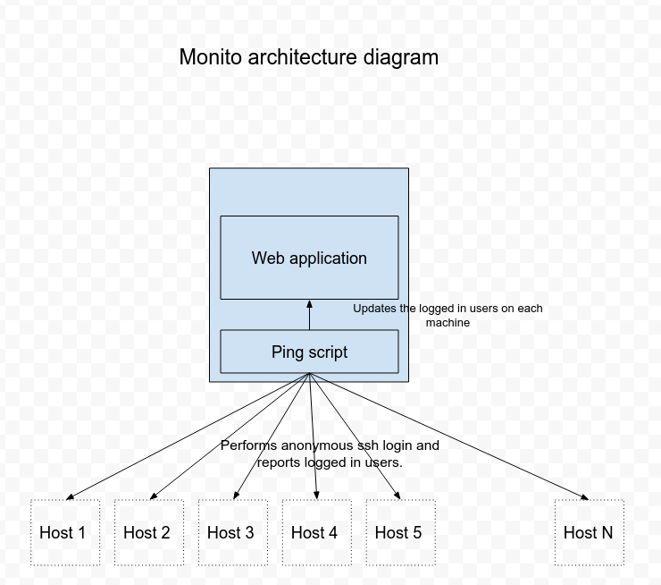

#  #

It monitors the servers on a network using a config file and reports the users that are currently logged in it.

# What is this repository for? ###

This repo is for Monito related development and issues. This app has not been tested on windows os.

##### Pre-requisites
    - `pip` or `easy_install`
    - Create a shared secret key for your machines in order to allow anonymous ssh login to monito.
##### Dependencies
	* python3
	* linux os
##### How to setup the app
	* Clone the project
	* Download virtualenvwrapper
	    - `pip install virtualenvwrapper`
	* Create new virtual environment
	    - `mkvirtualenv monito`
    * Shift to the environment
        - `source ~/.virtualenvs/monito/bin/activate`
	* Install dependencies
		- `pip install -r dev-requirements.txt`
	* Give execute permissions to the script (fetch_machines.sh)
		- `chmod +x ./monito.sh`
    * Create a csv file (without headers) with the following format
        - hostname,owner name,username-to-use-to-login

##### Run the app
    `python app.py`

##### Run the script for getting the live users
    `./monito.sh -f /path/to/machinefile -k /path/to/ssh-key/file [-m <false/true>]`
    Note: Running the above script with true will remove the owners and current users from the database.

##### Technical diagram

    

##### Misc
    * Open `http://localhost:5000` for viewing the dashboard.
	* Use `-h` for help menu.
